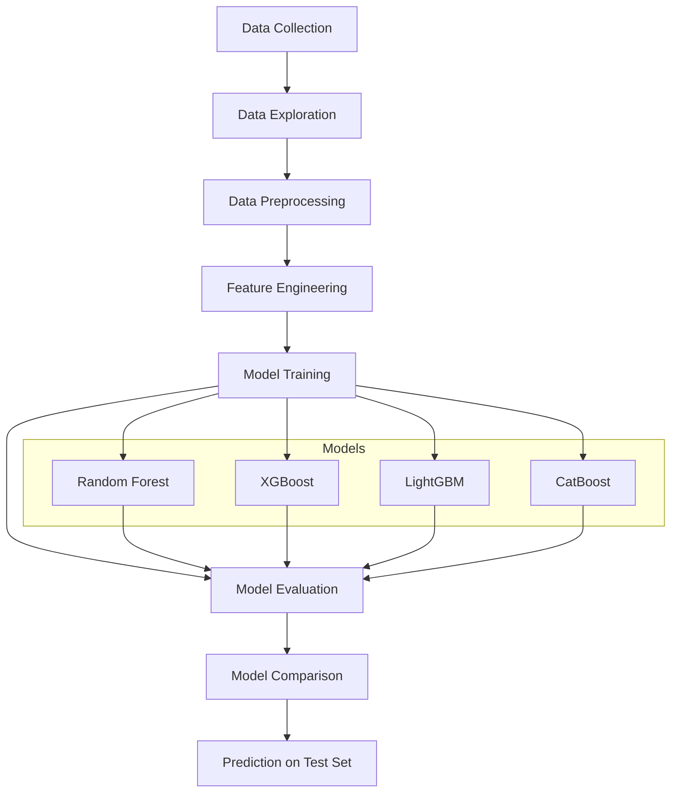
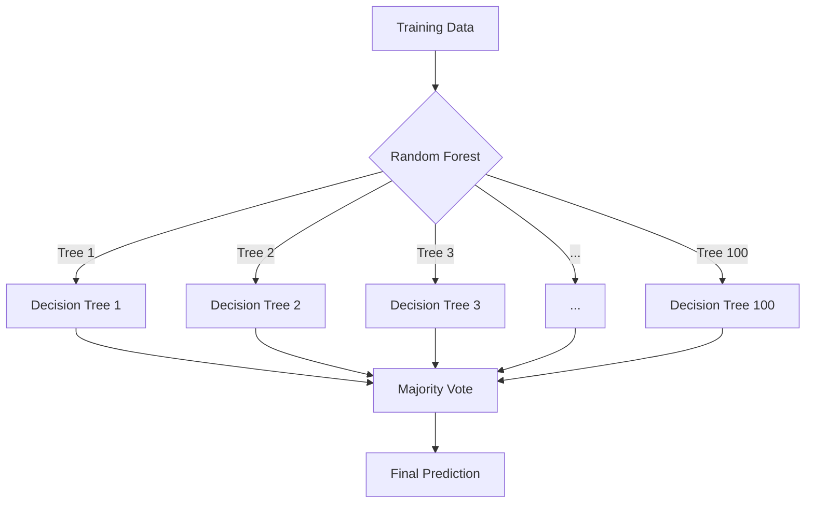
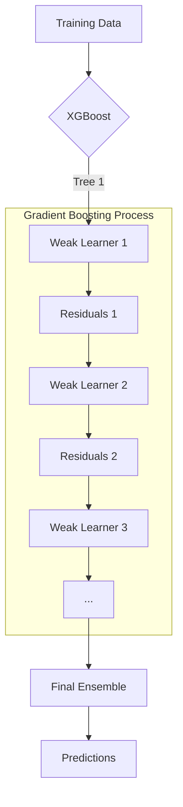
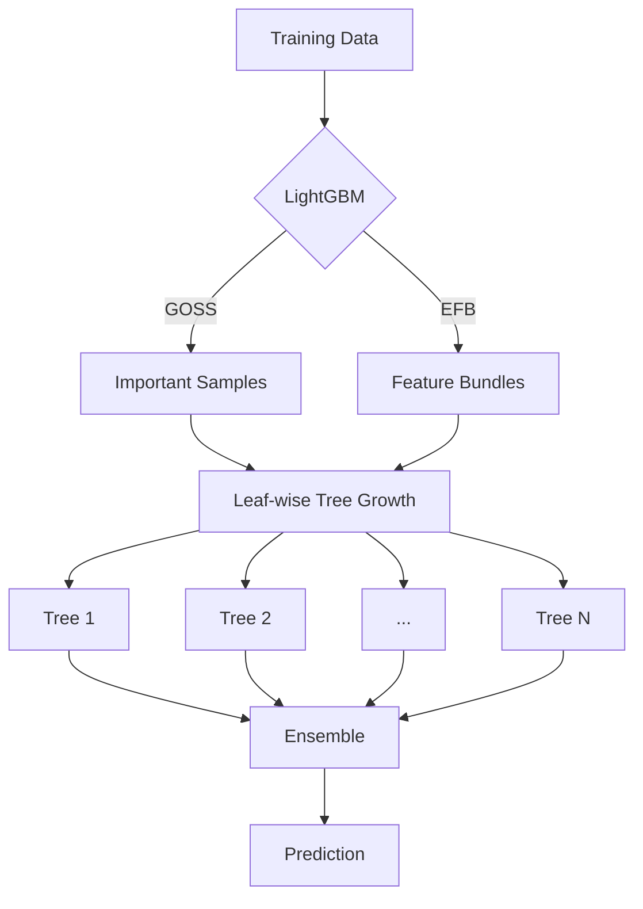
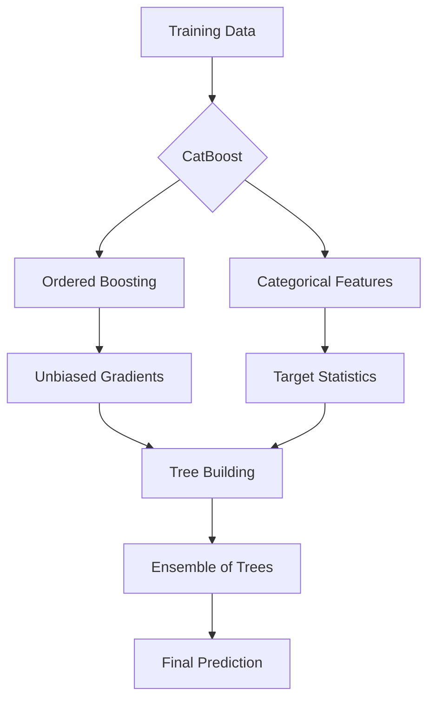
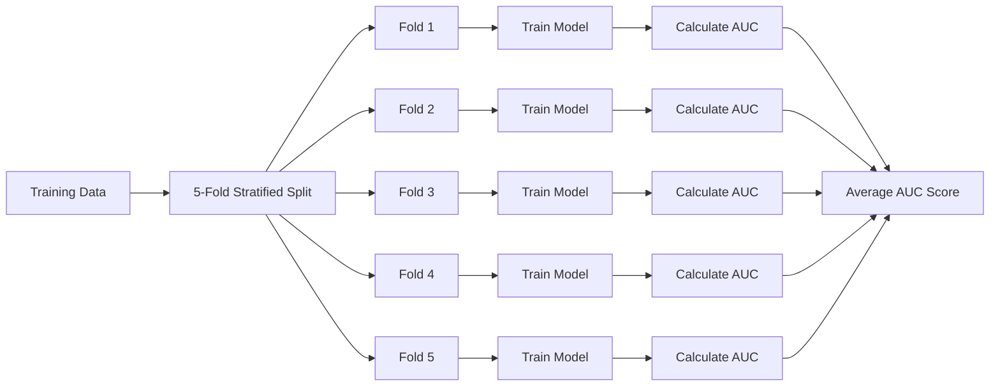
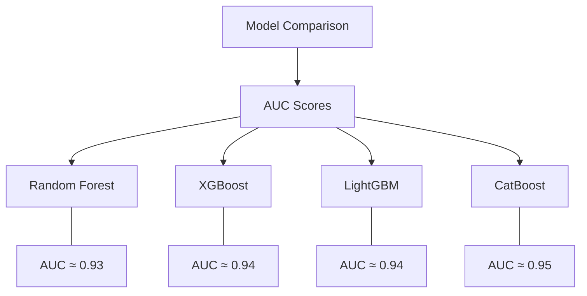

# Loan Approval Prediction


## Table of Contents
- [Overview](#overview)
- [Project Structure](#project-structure)
- [Dataset Description](#dataset-description)
- [Data Flow and Methodology](#data-flow-and-methodology)
- [Feature Engineering](#feature-engineering)
- [Machine Learning Models and Mathematical Theory](#machine-learning-models-and-mathematical-theory)
  - [Random Forest](#random-forest)
  - [XGBoost](#xgboost)
  - [LightGBM](#lightgbm)
  - [CatBoost](#catboost)
- [Model Evaluation](#model-evaluation)
  - [ROC Curve and AUC](#roc-curve-and-auc)
- [Results and Comparison](#results-and-comparison)


## Overview

This project aims to predict loan approval status using machine learning algorithms. It uses a dataset containing various borrower characteristics and loan attributes to build and evaluate several classification models that can determine whether a loan is likely to be approved (represented by 0) or denied (represented by 1).

The project implements and compares four state-of-the-art gradient boosting and ensemble algorithms:
- Random Forest
- XGBoost
- LightGBM
- CatBoost

## Project Structure

```
LoanApprovalPrediction/
│
├── lap.ipynb            # Main Jupyter notebook with code and analysis
├── train.csv            # Training dataset
├── test.csv             # Test dataset
└── README.md            # Project documentation
```

## Dataset Description

The dataset contains information about loan applicants and their loan applications with the following features:

| Feature | Description | Type |
|---------|-------------|------|
| id | Unique identifier for each record | Integer |
| person_age | Age of the applicant | Integer |
| person_income | Annual income of the applicant | Float |
| person_home_ownership | Home ownership status (e.g., RENT, OWN) | Categorical |
| person_emp_length | Employment length in years | Float |
| loan_intent | Purpose of the loan (e.g., EDUCATION, MEDICAL, PERSONAL) | Categorical |
| loan_grade | Loan grade (A to G) | Categorical |
| loan_amnt | Loan amount requested | Float |
| loan_int_rate | Interest rate on the loan | Float |
| loan_percent_income | Loan amount as percentage of income | Float |
| cb_person_default_on_file | Historical default status (Y/N) | Categorical |
| cb_person_cred_hist_length | Length of credit history in years | Integer |
| loan_status | Target variable (0 = Approved, 1 = Denied) | Binary |

The training dataset consists of 58,645 records, and there are no missing values in the data.

## Data Flow and Methodology



The project follows a standard machine learning workflow:

1. **Data Exploration**: Analyze the structure and distribution of the dataset.
2. **Data Preprocessing**: Handle categorical features through encoding.
3. **Model Training**: Train multiple machine learning models using cross-validation.
4. **Model Evaluation**: Evaluate models using ROC curves and AUC scores.
5. **Model Comparison**: Compare the performance of different models.

## Feature Engineering

The categorical features are encoded using category codes:

```python
for col in ['person_home_ownership', 'loan_intent', 'loan_grade', 'cb_person_default_on_file']:
    train_data[col] = train_data[col].astype('category').cat.codes
    test_data[col] = test_data[col].astype('category').cat.codes
```

This encoding transforms categorical text values into numeric values that can be processed by machine learning algorithms.

## Machine Learning Models and Mathematical Theory

### Random Forest

Random Forest is an ensemble learning method that constructs multiple decision trees during training and outputs the average prediction (for regression) or the mode of classes (for classification) of the individual trees.

**Mathematical Foundation**:

For a classification problem with $K$ classes, each tree provides a classification output. The final prediction is determined by majority voting across all trees:

$$ \hat{y} = \text{mode}(\hat{y}_1, \hat{y}_2, \ldots, \hat{y}_B) $$ 

Where:
- $\hat{y}$ is the final prediction
- $\hat{y}_1, \hat{y}_2, \ldots, \hat{y}_B$ are the predictions from individual trees
- $B$ is the number of trees in the forest

The Random Forest algorithm introduces two key concepts to improve over standard decision trees:
1. **Bootstrap Aggregating (Bagging)**: Each tree is trained on a random subset of the data with replacement.
2. **Feature Randomness**: At each split in each tree, only a random subset of features is considered.

**Model Implementation**:
```python
RandomForestClassifier(n_estimators=100, random_state=42)
```

The model uses 100 trees with a fixed random state for reproducibility.



### XGBoost

XGBoost (eXtreme Gradient Boosting) is an optimized distributed gradient boosting library designed for efficient and scalable machine learning.

**Mathematical Foundation**:

XGBoost optimizes a regularized objective function that combines a loss function and a regularization term:

$$  \mathcal{L} = \sum_{i=1}^{n} l(y_i, \hat{y}_i) + \sum_{k=1}^{K} \Omega(f_k) $$ 

Where:
- $l$ is the loss function (e.g., logistic loss for binary classification)
- $\Omega$ is the regularization term that penalizes the complexity of the model
- $f_k$ represents the $k$-th tree in the ensemble
- $n$ is the number of samples
- $K$ is the number of trees

The prediction for each instance is the sum of predictions from all trees:

$$ \hat{y}_i = \sum_{k=1}^{K} f_k(x_i) $$ 

XGBoost uses Newton-Raphson method to optimize this objective, which requires both the first and second derivatives of the loss function.

**Model Implementation**:
```python
xgb.XGBClassifier(use_label_encoder=False, eval_metric='logloss', random_state=42)
```



### LightGBM

LightGBM is a gradient boosting framework that uses tree-based learning algorithms. It is designed for distributed and efficient training with larger datasets.

**Mathematical Foundation**:

LightGBM optimizes a similar objective function to XGBoost but introduces two novel techniques:
1. **Gradient-based One-Side Sampling (GOSS)**: Focuses on instances with larger gradients while randomly sampling instances with smaller gradients.
2. **Exclusive Feature Bundling (EFB)**: Bundles mutually exclusive features to reduce dimensionality.

The GOSS approach is defined as:

$$ \tilde{g}_j(d) = \frac{1}{n} \left( \sum_{x_i \in A_j} g_i + \frac{n-a}{b} \sum_{x_i \in B_j} g_i \right) $$ 

Where:
- $A_j$ are instances with large gradients in leaf $j$
- $B_j$ are randomly sampled instances with small gradients
- $a$ and $b$ are the sizes of sets $A$ and $B$ respectively
- $g_i$ is the gradient for instance $i$

**Model Implementation**:
```python
lgb.LGBMClassifier(random_state=42)
```



### CatBoost

CatBoost is a gradient boosting algorithm that handles categorical features automatically during training. It is designed to fight prediction shift caused by target leakage in classical gradient boosting.

**Mathematical Foundation**:

CatBoost introduces two key innovations:
1. **Ordered Boosting**: A permutation-driven approach that reduces target leakage.
2. **Categorical Feature Processing**: Automatic handling of categorical features using various statistics.

For ordered boosting, CatBoost uses the following formula for categorical features:

$$ \text{Value}(cat\_feature, target) = \frac{\sum_{i=1}^{n} [x_i = cat\_feature] \times target_i + a \times p}{\sum_{i=1}^{n} [x_i = cat\_feature] + a} $$ 

Where:
- $[x_i = cat\_feature]$ is an indicator function
- $target_i$ is the target value for the $i$-th sample
- $a$ is a smoothing parameter
- $p$ is a prior probability

**Model Implementation**:
```python
cb.CatBoostClassifier(iterations=125, depth=7, learning_rate=0.1, random_seed=42, verbose=0)
```

The model uses 125 iterations (trees), a maximum depth of 7, and a learning rate of 0.1.



## Model Evaluation

### ROC Curve and AUC

The models are evaluated using the Receiver Operating Characteristic (ROC) curve and the Area Under the Curve (AUC) metric.

**Mathematical Foundation**:

The ROC curve plots the True Positive Rate (TPR) against the False Positive Rate (FPR) at various threshold settings:

$$ TPR = \frac{TP}{TP + FN} $$ 
$$ FPR = \frac{FP}{FP + TN} $$ 

Where:
- TP = True Positives
- FP = False Positives
- TN = True Negatives
- FN = False Negatives

The AUC represents the probability that a classifier will rank a randomly chosen positive instance higher than a randomly chosen negative one:

$$ AUC = P(score(x_{positive}) > score(x_{negative}))$$ 

A perfect classifier has an AUC of 1, while a random classifier has an AUC of 0.5.

**Implementation**:

The evaluation process uses 5-fold stratified cross-validation to ensure robust assessment:

```python
skf = StratifiedKFold(n_splits=5, shuffle=True, random_state=42)
```

For each fold, the model is trained on the training set, and then predictions are made on the validation set:

```python
for train_idx, valid_idx in skf.split(X, y):
    X_train, X_valid = X.iloc[train_idx], X.iloc[valid_idx]
    y_train, y_valid = y.iloc[train_idx], y.iloc[valid_idx]
    
    # Fit model
    model.fit(X_train, y_train)
    
    # Predict probabilities
    y_valid_pred_proba = model.predict_proba(X_valid)[:, 1]
    
    # Compute ROC curve and AUC
    fpr, tpr, _ = roc_curve(y_valid, y_valid_pred_proba)
    auc = roc_auc_score(y_valid, y_valid_pred_proba)
```



## Results and Comparison

The models are compared based on their AUC scores:


